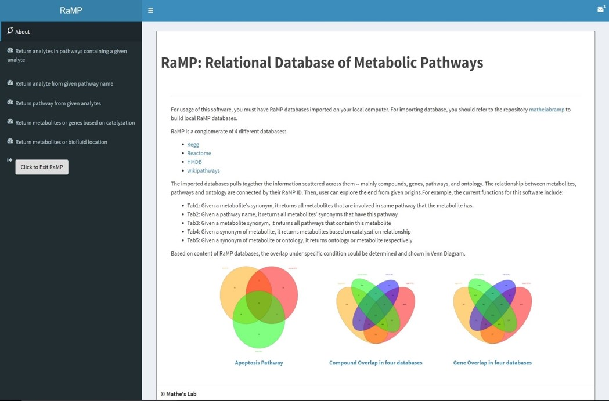
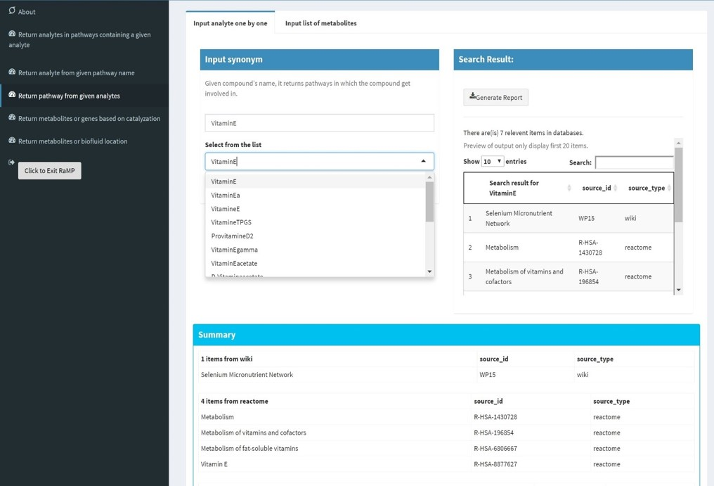
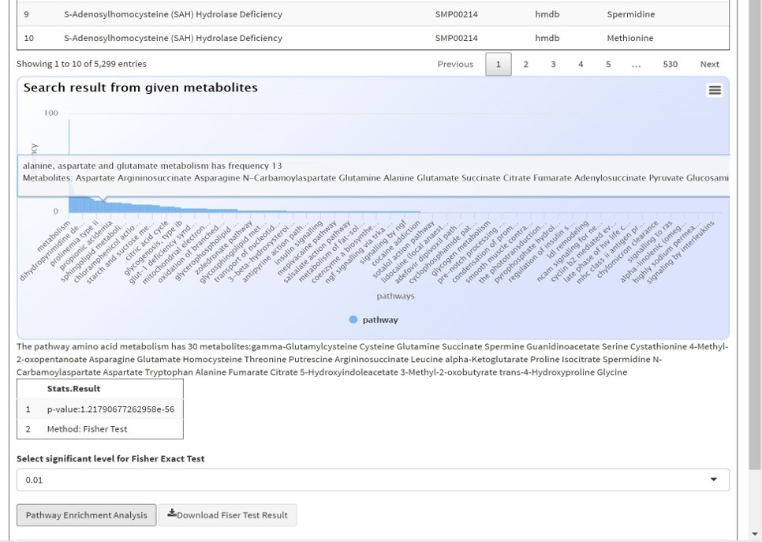
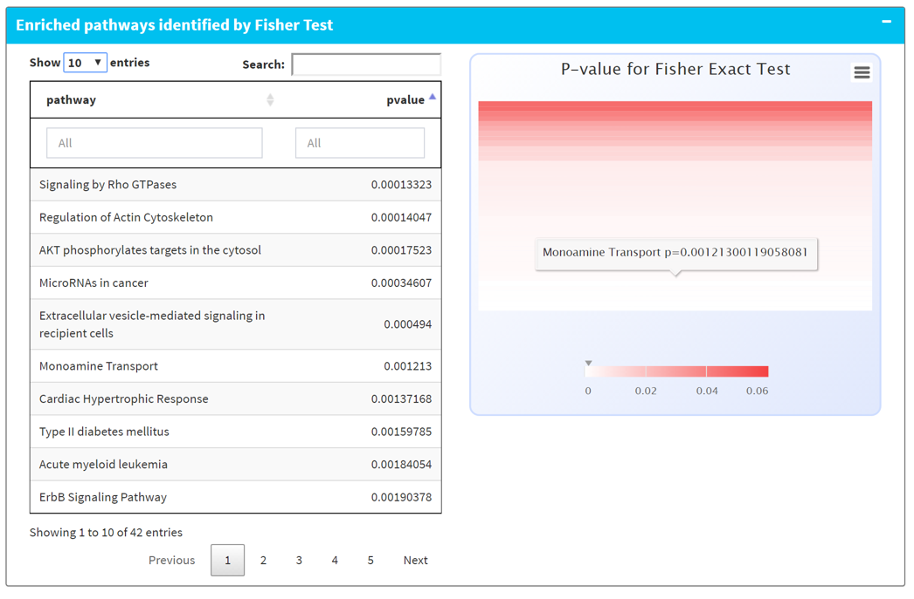

# RaMP Relational Database of Metabolomic Pathways
Metabolomics involves the systematic study of all metabolites (metabolome) measured in biospecimens such as cells, tissues, and biofluids. Metabolomics plays a critical role in translational research, and interpretation of metabolomics data contributes to better understanding of cellular biology and genomics.

However, functional interpretation of disease-associated metabolites is challenging, and the connection between biological mechanisms and disease-specific metabolomics profiles are usually unknown. Further ,publicly available metabolomics data are generally sparse, and either alone cannot provide comprehensive analysis. 

Because an integrated database is not readily available for download and integration with other web tools,we developed RaMP (Relational databases of Metabolomics Pathway) by integrating metabolite/protein/gene biological pathways from publicly available databases. To use and query RaMP, we have developed an R package with associated Rshiny app. The user-friendly web app enables complex queries, statistical analyses, and interactive plots of results to aid intepretation of metabolomics data.<br />

Front Page:<br/>


Search WorkFlow:<br/>





## Getting Started
This repo is the user interface that is integrated to a R package format.
If you have go through the process through importing RaMP database instead of having mysql dump file, skip this part.
In order to use the web application, you need 
* The R code under this repo
* The mysql dump file that has all content of RaMP database
### Manually importing mysql database from dump file
You firstly need a mysql service running locally with account and password.
If you have not dealed with mysql at all, here is the link to download MySQL cloud service [MySQL Downloads](https://www.mysql.com/downloads/). Please download MySQL WorkBench at this link. During the process of installation, it will ask you create password for root user.
If you aleady had a MySQL server setup on your computer, below is the procedure how to import RaMP database from dump file to MySQL server.
Here is another link for resetting password for MySQL server just in case you forgot that [MySQL References 5.7 - How to reset root password ] (https://dev.mysql.com/doc/refman/5.7/en/resetting-permissions.html)
Firstly, open command prompt 
```
mysql -u root -p
create database mathelabramp
```
Now you have an empty database for importing your dump file.
Open command prompt
```
cd directory-of-mysqldump-file
mysql -u root -p mathelabramp < mysqldump.sql
```
It's okay if you do not want to use `mathelabramp` as the name of database. Please do remember the name of database. It will be needed in the future usage. 
After you import mysql, you will find 8 tables in the `mathelabramp`
1. analyte
1. analyehasontology
1. analytehaspathway
1. analytesynonym
1. catalyzed
1. ontology
1. pathway
1. source
At this step, you can directly use RaMP database by MySQL.
You can try:
```
mysql -u root -p
use mathelabramp;
select * from analytesynonym where synonym = "glucose";
```
### Install and load this package 
You can install this package directly from GitHub.
```R
install_github("RaMP2",username = "Bofei5675")
```
Then, you can load the package by:
```R
RaMP::runRaMPapp(
  dbname = "Database name that you input previously",
  username = "root",
  password = "Your password for the MySQL server",
  host = "localhost"
  )
```
The username not has to be `root`. It depends on how you have access to mysql service by command prompt. The host is usually `localhost`, but could also be something different. Basically, it matches the pattern that how you login to MySQL by command prompt
```MySQL
mysql -u [username] -h [host] -p [password]
```
Then, the app is ready to use.

### Prerequisites
```
Have RaMP database locally
```
## Authors
* **Bofei Zhang** - *Web Interface* - [Bofei5675](https://github.com/Bofei5675)
## License

## Acknowledgements

